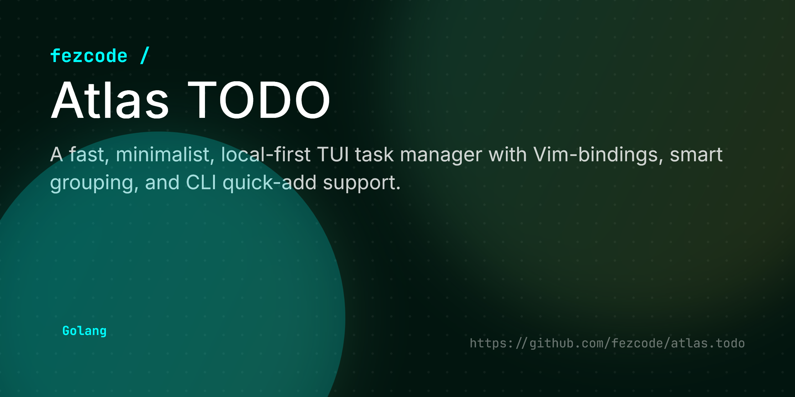

# Atlas Tones 🔔



A fast, metadata-driven repository for iPhone ringtones and notification sounds. Managed by `gobake` and `piml`.

## Features
- **Categorized Sounds:** Sounds are grouped by category (e.g., Age of Empires 2, Civ 6).
- **PIML Metadata:** Easy-to-manage sound descriptions and types using the PIML format.
- **Cross-Platform:** Built with Go, works on Windows, macOS, and Linux.
- **Easy Installation:** Guided installation process to get sounds onto your iPhone.

## Prerequisites
- **Ringtones:** Must be in `.m4r` format (AAC encoded).
- **iTunes / Finder:** Required for syncing to non-jailbroken devices.

## Usage

### List all sounds
```bash
atlas.tones list
```

### Prepare a sound for installation
```bash
atlas.tones install "Age of Empires 2" Wololo
```
*This will open your file manager and highlight the file for you to drag into iTunes/Finder.*

## Adding New Sounds
1. Create a new directory in `sounds/`.
2. Add your `.m4r` files.
3. Create a `metadata.piml` following this template:

```piml
(category) Category Name
(description) Short description.

(sound)
  > (item)
    (title) Sound Title
    (file) filename.m4r
    (type) ringtone
```

## Building
Requires `gobake`.
```bash
gobake build
```
